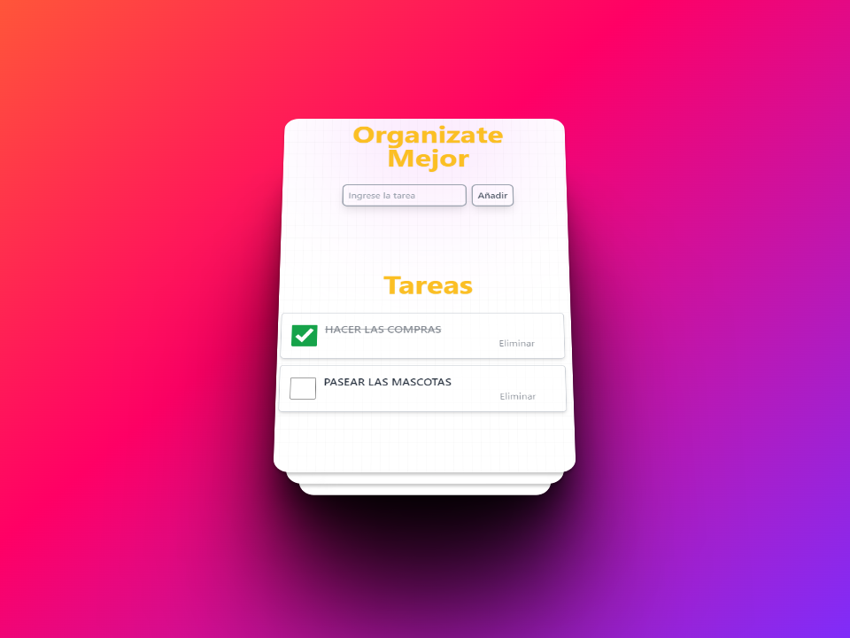
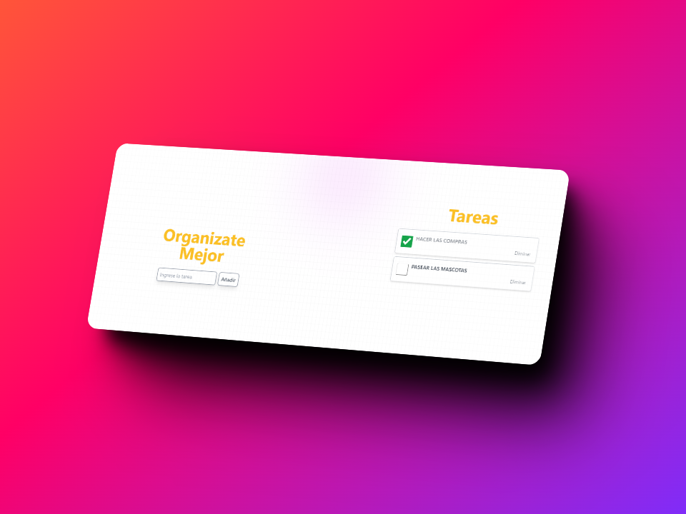

# React + Vite

Este es un trabajo realizado con las dos tecnologias indicadas anteriormente.

Trabajo que se basa en organizar las tareas que tenes en el dia.

Cada tarea que se añade se podra ir tachando o en su defecto eliminando mientras se van cumpliendo

- [@vitejs/plugin-react](https://github.com/vitejs/vite-plugin-react/blob/main/packages/plugin-react/README.md) uses [Babel](https://babeljs.io/) for Fast Refresh
- [@vitejs/plugin-react-swc](https://github.com/vitejs/vite-plugin-react-swc) uses [SWC](https://swc.rs/) for Fast Refresh

Aca les presento como se veria en formato Desktop.

Aca les presento como se veria en formato Movil.

!